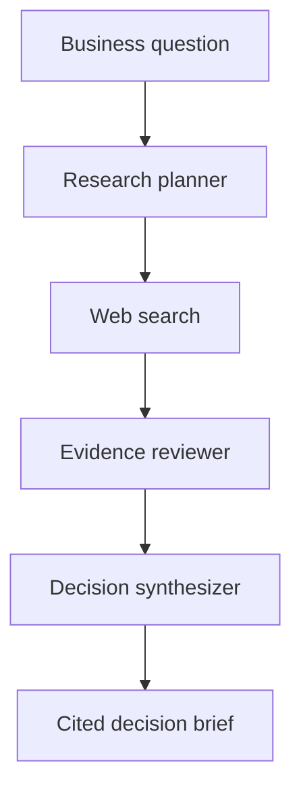

# Evidence-Grounded Business Research Agent

An AI-powered research and decision-support application that transforms a business question into a structured research plan, searches for external evidence, evaluates source quality, and produces a cited decision brief.

## Overview

Business decisions often require information from multiple sources, but search results alone do not provide a reliable recommendation. This project implements an end-to-end research workflow that separates planning, evidence collection, evidence review, and decision synthesis.

The system is designed to avoid unsupported conclusions by:

- generating focused research questions and search queries;
- collecting current web evidence through Tavily;
- evaluating source quality and relevance separately;
- attaching source identifiers to evidence-backed findings;
- lowering confidence when evidence is incomplete or unreliable;
- using rule-based fallbacks when an AI review step fails.

## Workflow



### 1. Research planning

The planner converts a decision question into:

- researchable subquestions;
- concise search-engine queries;
- observable success criteria.

### 2. Evidence collection

Search queries are submitted concurrently through the Tavily API. Results are normalized and filtered using relevance scores.

### 3. Evidence review

Each selected source is reviewed independently for:

- source type;
- source quality;
- decision relevance;
- supported claim;
- limitations.

If one AI review fails, only that source uses the rule-based fallback. Other sources continue through the normal review process.

### 4. Decision synthesis

The synthesizer produces:

- an executive summary;
- a recommendation;
- a confidence level;
- evidence-backed findings with source IDs;
- strategic alternatives;
- risks and uncertainty;
- recommended next steps.

## Technology Stack

- Python
- FastAPI
- Pydantic
- Groq API
- `openai/gpt-oss-20b`
- Tavily Search API
- HTML, CSS and JavaScript
- Uvicorn

## Project Structure

```text
business-research-decision-agent/
├── frontend/
│   ├── index.html
│   ├── styles.css
│   └── app.js
├── scripts/
│   ├── test_groq.py
│   ├── test_tavily.py
│   └── test_research_pipeline.py
├── src/
│   ├── __init__.py
│   ├── models.py
│   ├── reviewer.py
│   ├── search_tool.py
│   ├── synthesizer.py
│   └── workflow.py
├── .env.example
├── .gitignore
├── app.py
├── LICENSE
├── README.md
└── requirements.txt
```

## Local Setup

### 1. Clone the repository

```powershell
git clone https://github.com/jeffreyzhjin/business-research-decision-agent.git
cd business-research-decision-agent
```

### 2. Create a virtual environment

```powershell
python -m venv .venv
.venv\Scripts\Activate.ps1
```

### 3. Install dependencies

```powershell
pip install -r requirements.txt
```

### 4. Configure environment variables

Copy the environment template:

```powershell
Copy-Item .env.example .env
```

Open `.env` and provide your own API keys:

```env
GROQ_API_KEY=your_groq_api_key
TAVILY_API_KEY=your_tavily_api_key
```

Never commit the `.env` file.

### 5. Start the application

```powershell
python -m uvicorn app:app --reload
```

Open the application:

```text
http://127.0.0.1:8000
```

Interactive API documentation is available at:

```text
http://127.0.0.1:8000/docs
```

## Example Research Request

```json
{
  "question": "Should a regional retailer launch same-day delivery?",
  "context": "The company operates 20 stores in Shenyang, online orders account for approximately 15% of sales, and the company has no in-house delivery team.",
  "horizon": "90 days"
}
```

The API returns a structured research plan, reviewed evidence, and a decision brief with traceable source identifiers.

## API Endpoints

| Method | Endpoint | Description |
|---|---|---|
| `GET` | `/api/health` | Checks whether the application is running |
| `POST` | `/api/research` | Runs the complete research and decision pipeline |
| `GET` | `/docs` | Opens the interactive API documentation |

## Reliability Design

The application includes several safeguards:

- strict Pydantic validation for structured outputs;
- prohibited extra fields in AI-generated data models;
- relevance-score filtering for search results;
- independent review of each evidence source;
- deterministic fallback assessments;
- validation of source IDs used in decision findings;
- conservative recommendations when evidence is weak.

## Current Limitations

- Search quality depends on the wording of generated queries.
- Public web search may return outdated, commercial, or indirectly relevant sources.
- Rule-based fallback assessments require manual verification.
- The application does not currently persist research sessions.
- Free API tiers may introduce request limits or slower responses.
- The generated decision brief supports human judgment and should not be treated as professional financial, legal, or regulatory advice.

## Future Improvements

- Add source-date extraction and freshness scoring.
- Support domain filtering and preferred-source lists.
- Save and compare previous research sessions.
- Add export to PDF or Markdown.
- Introduce automated evaluation datasets.
- Add user authentication and deployment monitoring.

## License

This project is licensed under the MIT License.