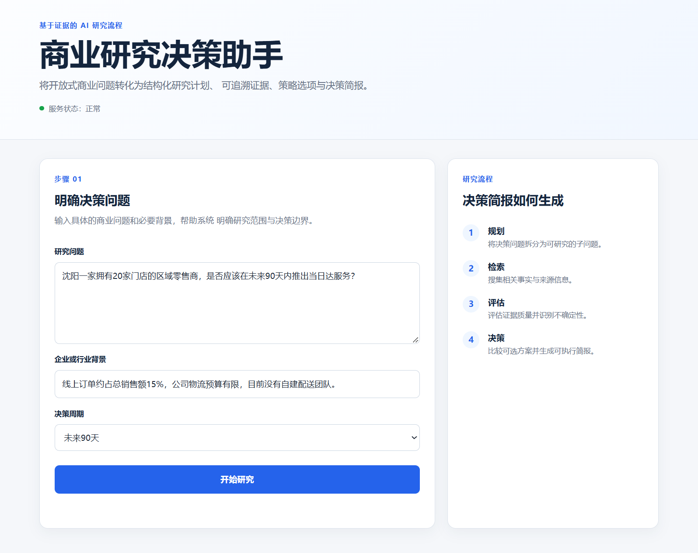
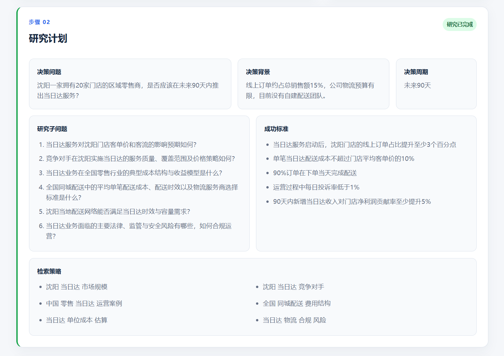
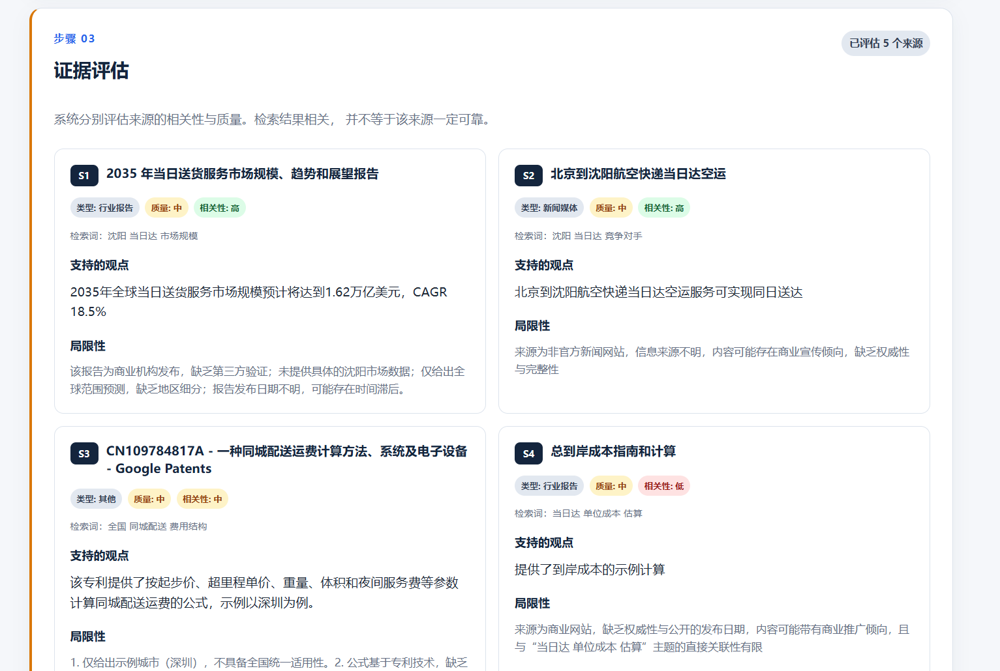
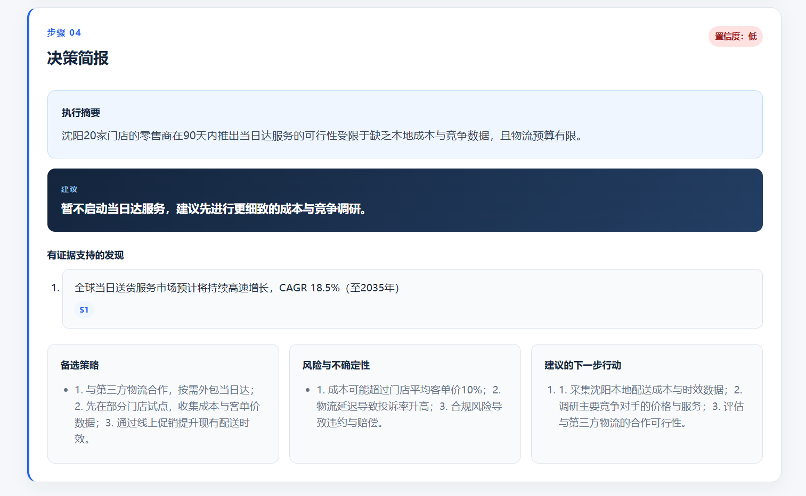
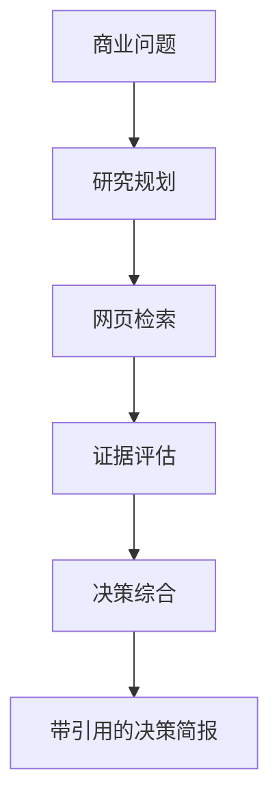

# 商业研究决策助手

一个基于可追溯证据的商业研究与决策支持应用。用户输入开放式商业问题后，系统会生成结构化研究计划、检索外部证据、评估来源质量，并输出带来源编号的中文决策简报。

## 在线演示

[打开在线应用](https://business-research-decision-agent.vercel.app)

> 说明：应用界面和研究结果默认使用简体中文。`vercel.app` 域名在部分中国大陆网络中可能访问不稳定。

## 界面展示

### 步骤 1：输入商业问题与决策背景



### 步骤 2：生成结构化研究计划



### 步骤 3：评估证据质量与相关性



### 步骤 4：输出带引用的决策简报



## 项目简介

商业决策往往需要综合市场需求、成本、竞争、运营和监管等多方面信息。普通搜索只能返回网页结果，不能直接形成可靠建议。本项目将研究过程拆分为规划、检索、评估和决策四个阶段，使最终结论能够回溯到具体来源，并在证据不足时主动降低置信度。

系统主要完成以下任务：

- 将商业问题拆分为可研究的子问题、检索词和成功标准；
- 通过 Tavily 搜集当前公开网页证据；
- 分别评估来源质量和决策相关性；
- 提炼每条来源直接支持的观点及其局限；
- 为关键发现附加来源编号和原文链接；
- 在证据薄弱或流程失败时给出保守建议和人工核验提示。

## 工作流程



### 1. 研究规划

系统将用户输入转化为：

- 可研究的子问题；
- 简洁的搜索引擎检索词；
- 可观察、与决策直接相关的成功标准。

### 2. 证据检索

多个检索词通过 Tavily API 并发执行。搜索结果经过格式统一和相关性筛选后进入证据评估环节。

### 3. 证据评估

每条入选来源分别评估：

- 来源类型；
- 来源质量；
- 决策相关性；
- 直接支持的观点；
- 证据局限性。

如果某条来源的 AI 评估失败，只有该来源转入规则评估，其他来源仍继续正常处理。

### 4. 决策综合

最终输出包括：

- 执行摘要；
- 核心建议；
- 置信度；
- 带来源编号的关键发现；
- 备选策略；
- 风险与不确定性；
- 建议的下一步行动。

## 示例研究问题

```text
研究问题：
沈阳一家拥有20家门店的区域零售商，是否应该在未来90天内推出当日达服务？

企业或行业背景：
线上订单约占总销售额15%，公司物流预算有限，目前没有自建配送团队。
```

## 技术实现

- Python
- FastAPI
- Pydantic
- Groq API
- `openai/gpt-oss-20b`
- Tavily Search API
- HTML、CSS、JavaScript
- Uvicorn

## 项目结构

```text
business-research-decision-agent/
├── frontend/
│   ├── index.html
│   ├── styles.css
│   └── app.js
├── scripts/
│   ├── test_groq.py
│   ├── test_tavily.py
│   └── test_research_pipeline.py
├── src/
│   ├── __init__.py
│   ├── models.py
│   ├── reviewer.py
│   ├── search_tool.py
│   ├── synthesizer.py
│   └── workflow.py
├── .env.example
├── .gitignore
├── app.py
├── LICENSE
├── README.md
└── requirements.txt
```

## 本地运行

### 1. 克隆仓库

```powershell
git clone https://github.com/jeffreyzhjin/business-research-decision-agent.git
cd business-research-decision-agent
```

### 2. 创建并激活虚拟环境

```powershell
python -m venv .venv
.venv\Scripts\Activate.ps1
```

### 3. 安装依赖

```powershell
pip install -r requirements.txt
```

### 4. 配置环境变量

```powershell
Copy-Item .env.example .env
```

在 `.env` 中填写自己的 API Key：

```env
GROQ_API_KEY=your_groq_api_key
TAVILY_API_KEY=your_tavily_api_key
```

请勿将 `.env` 文件提交到 GitHub。

### 5. 启动应用

```powershell
python -m uvicorn app:app --reload
```

应用地址：`http://127.0.0.1:8000`

API 文档：`http://127.0.0.1:8000/docs`

## API 接口

| 方法 | 路径 | 功能 |
|---|---|---|
| `GET` | `/api/health` | 检查应用运行状态 |
| `POST` | `/api/research` | 执行完整研究与决策流程 |
| `GET` | `/docs` | 打开交互式 API 文档 |

## 可靠性设计

- 使用 Pydantic 对结构化输出进行严格校验；
- 禁止 AI 生成的数据模型包含额外字段；
- 根据相关性分数筛选搜索结果；
- 对每条证据进行独立评估；
- 单条评估失败时使用规则兜底；
- 校验决策发现引用的来源编号；
- 证据不足时降低置信度并采用保守建议。

## 当前局限

- 搜索质量会受到检索词表达方式的影响；
- 公开网页可能包含过时、商业化或间接相关的信息；
- 规则兜底生成的评估仍需要人工核验；
- 当前版本不会保存历史研究记录；
- 免费 API 套餐可能存在请求次数和响应速度限制；
- 决策简报仅用于辅助判断，不能替代专业的财务、法律或监管意见。

## 后续改进

- 增加来源日期提取与时效性评分；
- 支持指定优先来源和网站范围；
- 保存并比较历史研究记录；
- 支持导出 PDF 或 Markdown；
- 建立自动化评测数据集。

## License

本项目采用 MIT License。
